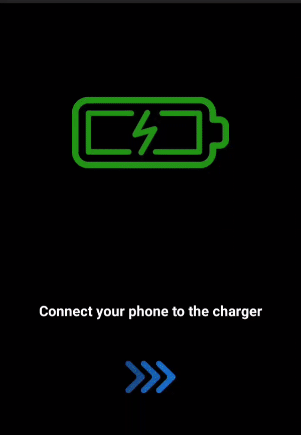

# Safe Charger

## Overview
This is a simple android application to maintain healthy battery life. 
It's known that the Li-ion battery will stop charging when full capacity is reached but still having at full charge for long duration at high temperatures may cause some degradation. Stopping before 100 may also give us extra battery discharge/charge cycles too.
Also, this is just a small idea which emerged when I heard the shocking news of my friend's phone exploded near his head after a complete charge.
Fortunately, nothing happened to him.

[Play Store link](https://play.google.com/store/apps/details?id=com.gpa.safecharge)

## Working
The following is the working of the application : 
* The application will be always idle
* When the android phone goes to the charging state, a background thread will be fired which checks the battery level in an optimized way.
* The application will trigger a notification sound when the charge reaches around 85%.

## UI
Used [Liquid swipe layout](https://github.com/Chrisvin/LiquidSwipe) to show the instructions. It is a cool library created by [Chrisvin Jem](https://github.com/Chrisvin) . He has created other cool libraries too. Please do checkout those awesome works :)

## Screenshots

###### Application

###### Settings on different devices which are to be enabled (android 8 or above)

PS : I am new to android development. So, there will be lot of code issues. Please feel free to suggest the corrections and contribute to this simple project.

