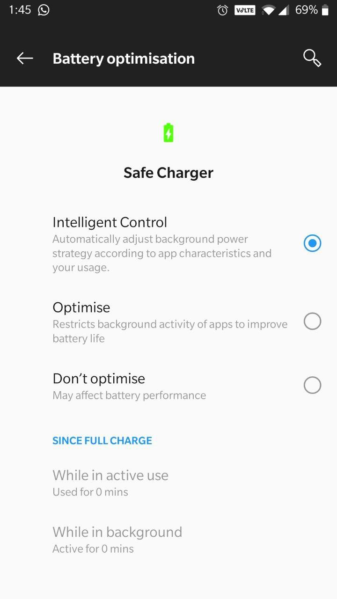
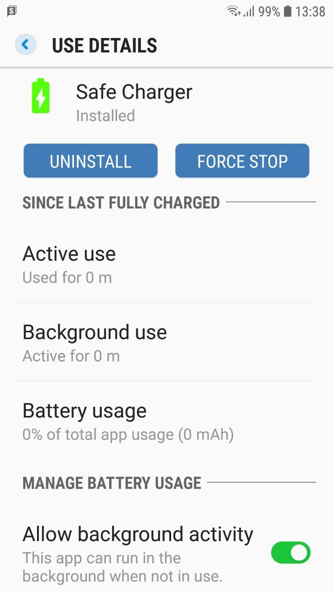

# Safe Charger

## Overview
This is a simple android application to maintain healthy battery life. 
It has been advised by some technology experts that the phone should not be  charged to a complete charge cycle repeatedly in order to maintain a good battery life.
Also, this is just a small idea which emerged when I heard the shocking news of my friend's phone exploded near his head after a complete charge.
Fortunately, nothing happened to him.

## Working
The following is the working of the application : 
* The application will be always idle
* When the android phone goes to the charging state, a background thread will be fired which checks the battery level in an optimized way.
* The application will trigger a notification sound when the charge reaches around 85%.

## UI
Used [Liquid swipe layout](https://github.com/Chrisvin/LiquidSwipe) to show the instructions. It is a cool library created by [Chrisvin Jem](https://github.com/Chrisvin) . He has created other cool libraries too. Please do checkout those awesome works :)

## Screenshots

###### Application

###### Settings on different devices which are to be enabled (android 8 or above)

PS : I am new to android development. So, there will be lot of code issues. Please feel free to suggest the corrections and contribute to this simple project.

